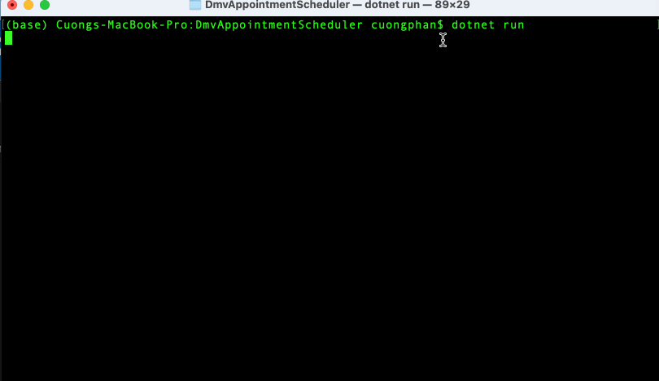

# DMV Code Challenge

### **Overview**

This is a small C# .net core application we developed and is an appointment scheduler for the Department of Motor Vehicles (DMV). The application reads in data for customers and assigns all customers to a single Teller. (which is ineffecient)
Your mission, if you choose to accept, is to create a more effecient algothrim to give each customer an appointment with a teller.

_Customer_

- 5,000 Total

* Available Data:
  - Id
  - Service Type
  - Duration of Appointment

_Teller_

- 150 Total
- Available Data:
  - Id
  - Specialty Type
  - Multiplier

**Details**

- When a customer's service type matches the specialty type of the assigned teller the multiplier with be multiplied against to customer's duration to reduce the appointment time.
-     Some customers' service type may not match any teller's specialty type.
-     Not all tellers will have the same multiplier even within the same specialty type.
-     Do **NOT** change Customer or Teller JSON Data or the how the output is calculated (Needs to output the teller with the longest duration and the total duration). However, refactor of the code is strongly encouraged.

**Goal**

We want to try to process all customers and have our tellers go home as early as possible. All the tellers will leave together once the last customer has been processed. Therefore, your results will **NOT** be measured according to the total number of time the tellers spend with customers but when the last customer is processed.

**Submission**

Create a git repository with your solution and resume.Then please email us a read access link to RigsentryCodeChallenge@gmail.com.

Thank you and good luck!

NOV Rigsentry Team

## Installation & Setup Instruction

## Note on file path to read customer and teller data:

### On windows:

```
@"InputData\"
```

### On Linux/macOS:

```
@"InputData"
```

### This application was developed using .NET Core Framework

For .NET installation and usage tutorial:

```
https://docs.microsoft.com/en-us/dotnet/core/tools/
```

Clone this repo then cd into DmvAppoinmentScheduler, run the command:

```
dotnet restore
```

To start the server, run the command:

```
dotnet run
```

## Result



## Authors

- **Cuong Phan** - https://github.com/cmphan
